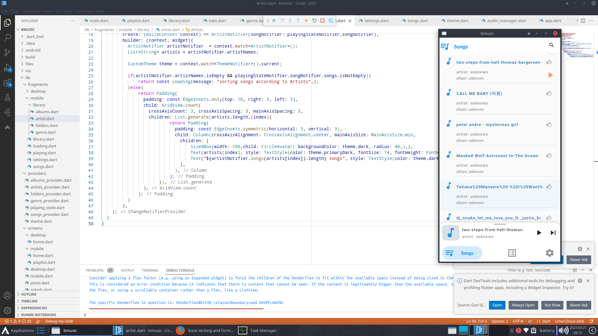
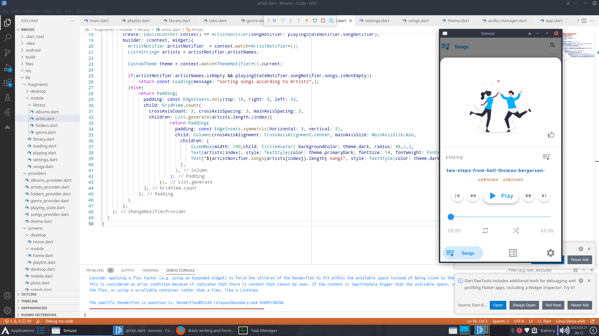

# B-Music

An Open source music player writen in Flutter for IOS and Android. play musics  on your local drive and download, upload and play musics directly from your Google drive.

### Features
- Play Music from internal memory
- Create Playlist
- Upload music to your Google Drive
- Download music from your Google Drive
- Play music directly from your Google Drive

## Development

Development is still in it's infancy, so there is a lot of stuff still to be done.

### Todos
- [x] Query device for Music Files
- [x] Sort them according to playlist
- [x] Search through music and Play List
- [ ] Play music files from Device:tada:
- [ ] link to Google Play account :tada:
- [ ] Browse through music files on Google Drive
- [ ] Download Music from Google Drive :tada:
- [ ] Upload Music from Goole Drive :tada:
- [ ] Play music files from Google Drive :tada:

Song list Screen

Playing Panel

